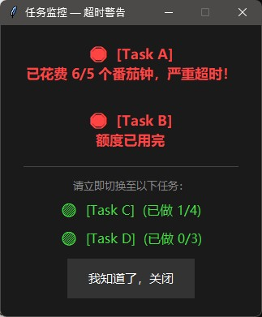

# Jaxiah's Utils

存放一些功能实用且一个文件就能讲清楚的脚本.

- [tasknotes_quota_monitor.py](#tasknotes_quota_monitorpy)
- [md_punct_cn2en.py](#md_punct_cn2enpy)
- [clang_format_dir.py](#clang_format_dirpy)

## tasknotes_quota_monitor.py

Obsidian TaskNotes 番茄钟配额守护进程. 在日记里声明每个任务今天最多投入几个番茄钟, 一旦某任务用满配额, 立刻弹出置顶窗口打断你, 并列出尚有盈余的任务引导切换.



弹窗分两个区域:

- **红色 Stop 区**: 显示超额任务, 打断当前行为
- **绿色 Go 区**: 列出待办任务及剩余配额, 引导下一步行动

**日记格式** (在当日笔记任意位置声明配额):

```markdown
- [[Task A]] : 5
- [[Task B]] : 4
```

**运行**: 首次运行自动生成 `tasknotes_quota_monitor.config.json`, 填入路径后重新运行.

```bash
pythonw tasknotes_quota_monitor.py   # 后台运行（无命令行窗口）
```

依赖: Python 3.8+, 标准库 (`tkinter`, `json`, `re`), 无需额外安装.

## md_punct_cn2en.py

将 Markdown 文件中的中文 (全角) 标点替换为英文 (半角) 标点, 并修正 CJK 与 Latin/数字之间的空格. 代码块, 行内代码, URL 保持原样不动.

```bash
python md_punct_cn2en.py file.md          # 输出到 stdout
python md_punct_cn2en.py -o out.md file.md  # 输出到指定文件
python md_punct_cn2en.py -i file.md       # 原地修改
python md_punct_cn2en.py -i docs/         # 递归处理目录
python md_punct_cn2en.py -i "**/*.md"     # glob 模式
```

## clang_format_dir.py

递归扫描目录下所有 C/C++/CUDA/GLSL/HLSL 源文件并用 `clang-format` 原地格式化. 要求目录内存在 `.clang-format`, 否则跳过. 多线程并行, 大型代码库也快.

```bash
python clang_format_dir.py src/                  # 格式化 src/ 下所有文件
python clang_format_dir.py src/ include/ -j 16   # 多目录, 16 线程
```

依赖: `clang-format` (需在 PATH 中), `tqdm` (`pip install tqdm`).
